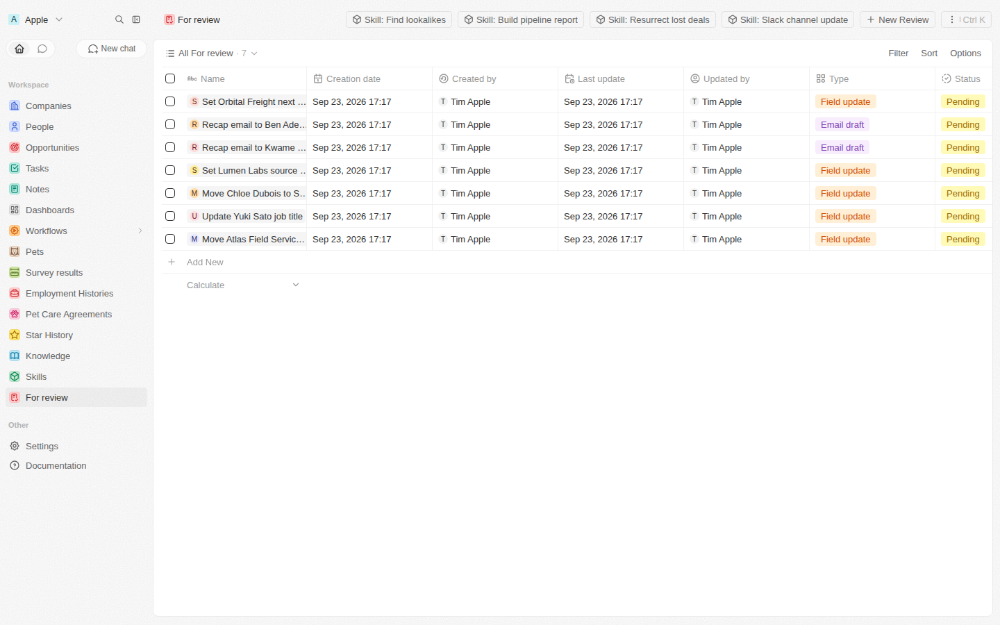
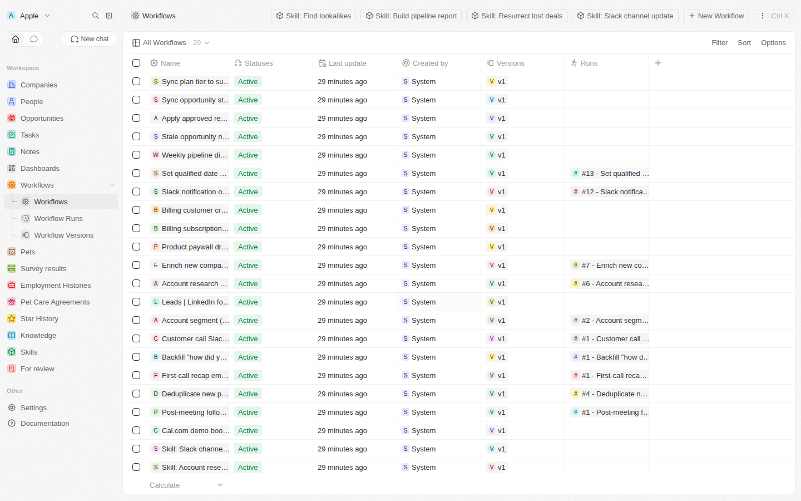
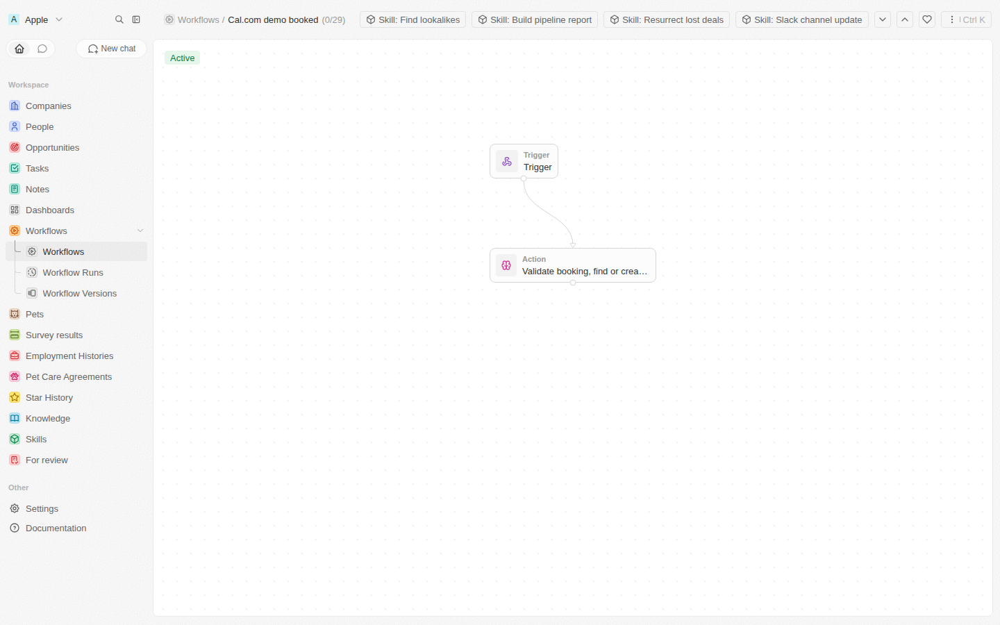
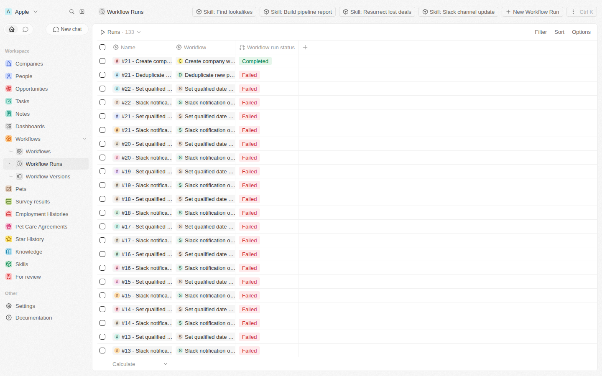

# Lightfield-style CRM on Twenty

This folder runs the real, open-source [Twenty CRM](https://github.com/twentyhq/twenty) (AGPL, pinned to
**v2.9.0**) and layers Lightfield's five primitives on top of it **without forking Twenty**. Everything goes through
Twenty's own extension points: custom objects and fields, workflows, AI agents, roles and permissions, and the
REST, GraphQL and MCP APIs. The provisioning script was run and verified against a local Twenty v2.9.0.

## The five primitives, mapped to Twenty

| Lightfield primitive | How it is built on Twenty |
|---|---|
| **Skills**: reusable playbooks you run against your data | Each playbook is registered three ways: as a **native Twenty AI skill** (Settings → AI → Skills, loaded by the assistant on demand), as a `Skill` record holding the instructions, and as a **manual-trigger workflow** ("Skill: Find lookalikes", …, pinned in the top bar) whose one step is an **AI agent step** running those instructions with full record access. Customize by editing `definitions/content.mjs` and re-running `provision.mjs --only=skills --force-workflows`. |
| **Knowledge**: company facts and rules the agent grounds in | A `Knowledge` object (category, body, optional company link) plus Twenty's **workspace AI instructions** (Settings → AI), which are appended to every system prompt: read Knowledge first, load full context, propose via Review, never move lead status backwards, ignore test bookings. The seeded "Rules for the agent" Knowledge record carries the longer version. |
| **Automations**: AI steps built with you in chat | Twenty **workflows**: a trigger (record created/updated, cron, inbound webhook, manual) plus steps (AI agent, HTTP request, send email). Every AI step is prompted to load the whole customer context (company, people, opportunities, notes), not just the trigger payload. Building one in chat is Twenty's own "Ask AI" with the seeded assistant, whose prompt carries Lightfield's three-question playbook: what should happen, when it runs, what it can touch. |
| **Run logs + "For review"** | Run logs are Twenty's built-in **Workflow Runs** (per-step output and errors; verified by firing a real `person.created` event). "For review" is the `Review` object: automations create a Review (`FIELD_UPDATE`, `EMAIL_DRAFT`, `SLACK_DRAFT`, `MERGE`, `NEW_RECORD`) instead of acting. A person moves it to `APPROVED` on the **Review board** kanban, and the **Apply approved review** workflow (trigger `review.updated`) applies it and sets `APPLIED` or `FAILED`. Runs go to completion; humans review after. |
| **Permissions** | Twenty **roles**. The `Lightfield Agent` role can read every object but write only `review`, `knowledge`, `skill`, `note` and `task`, with the `AI` and `HTTP_REQUEST_TOOL` flags. The assistant and every AI step run under it. Pass `--grant-writes` to also let it write people, companies and opportunities, and `--grant-email` for the send-email tool. Widening is an explicit, visible step, like Lightfield's permission prompt before activation. |

## Run it

Requirements: Docker with Compose, and an AI provider key (Anthropic or OpenAI) for the agent and AI steps.
Without a key everything provisions fine, but AI steps fail at run time with "No AI models are available".

```bash
cd twenty
cp .env.example .env              # set ENCRYPTION_KEY (openssl rand -base64 32) and ANTHROPIC_API_KEY or OPENAI_API_KEY
docker compose up -d
open http://localhost:3000        # sign up; the first user becomes the workspace admin
```

Then provision the layer with the account you just created:

```bash
cd provision
TWENTY_URL=http://localhost:3000 TWENTY_EMAIL=you@example.com TWENTY_PASSWORD='…' node provision.mjs
TWENTY_URL=http://localhost:3000 TWENTY_EMAIL=you@example.com TWENTY_PASSWORD='…' node verify.mjs
```

Why email and password rather than an API key: Twenty's workflow-builder mutations require a user session and
reject API keys. The script therefore signs in, and creates and activates workflows through Twenty's MCP endpoint
(`create_complete_workflow`). `TWENTY_API_KEY` is accepted too and works for objects, fields, roles, the agent and
records, but the MCP route still needs a key whose role has the `WORKFLOWS` flag.

The script is **idempotent**: it creates what is missing and skips what exists, so re-running is safe.
Useful flags: `--only=objects,fields,role,agent,skills,workflows,records,views`, `--force-workflows`
(recreate workflows from `definitions/content.mjs`), `--grant-writes`, `--grant-email`, `--dry-run`, `--verbose`.
Set `TWENTY_CONNECTED_ACCOUNT_ID` to make the weekly digest send real email; otherwise it lands in For review.

## What gets provisioned (verified output)

- **Objects**: `Knowledge`, `Skill`, `Review`, plus fields on `company` (segment, source, billingCustomerId),
  `person` (leadStatus, source), `opportunity` (nextStep, qualifiedAt) and the extra opportunity stages
  Discovery, Qualified, Negotiation, Won, Lost (appended to Twenty's defaults so existing records stay valid).
- **Role** `Lightfield Agent`, the **agent** `lightfieldAssistant` with the Lightfield system prompt, the workspace
  AI instructions, and 7 **native AI skills**.
- **27 active workflows**: the 20 automations in `definitions/content.mjs` (Cal.com demo booked, post-meeting
  follow-up, dedupe, first-call and follow-up recaps, account segmentation, LinkedIn form leads, account research,
  enrichment, billing sync, Slack on Won, qualified-date stamping, weekly digest, stale-deal nudge, support-desk
  syncs, "Apply approved review") and 7 skill workflows.
- **Sample data**: 12 companies, 20 people, 11 opportunities, 3 call notes, 6 Knowledge records, 7 Skill records,
  7 pending Reviews, and a **Review board** kanban view grouped by status.

`verify.mjs` checks all of the above and exits non-zero if anything is missing.

## What it looks like in Twenty

| For review queue | Automations (Skills pinned in the top bar) |
|---|---|
|  |  |

| Workflow canvas | Run logs |
|---|---|
|  |  |

The failed runs in the last screenshot are AI steps in this sandbox, which has no AI provider key
("No AI models are available"); with `ANTHROPIC_API_KEY` or `OPENAI_API_KEY` set they run.

## Layout

```
twenty/
  docker-compose.yml          self-hosted Twenty, pinned to v2.9.0
  .env.example
  provision/
    provision.mjs             creates objects, fields, role, agent, workflows, records, views (idempotent)
    verify.mjs                checks the workspace after provisioning
    login.mjs                 email + password → workspace access token
    twenty-client.mjs         tiny REST + GraphQL client
    definitions/content.mjs   the Lightfield content: knowledge, skills, 20 automations, seed records
```

## Notes from building against v2.9.0

- Field name `type` is reserved on custom objects, so the review type field is `reviewType`.
- Note and task links use morph relations: `noteTargets` takes `targetCompanyId` / `targetPersonId`, not `companyId`.
- Database-event triggers expose the record as `{{trigger.object.<field>}}`; webhook triggers expose the body as `{{trigger}}`.
- Object permissions cannot be set on system objects (`noteTarget`, `taskTarget`); the role skips them.

## Prototype UI

`../crm/` is a standalone static prototype of the Lightfield UI (review queue, chat-built automations with
permission grants, run logs, sequences, settings). It is a design reference for the workspace, not connected to Twenty.
